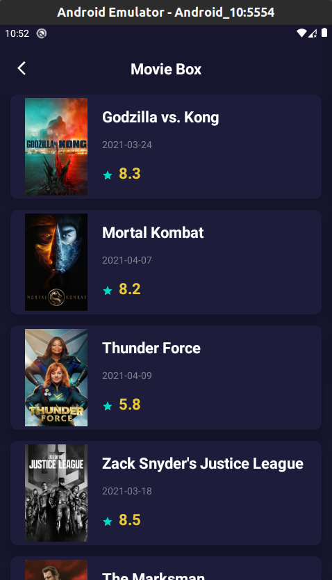
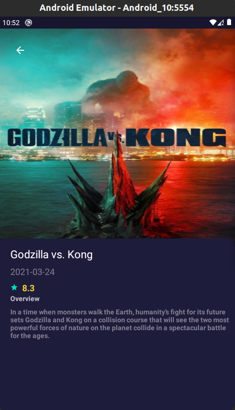

### Hi.. Welcome to our Mini hack. (Find the bug and solve it)

### This is a very simple movie application with 2 screens that fetch data from internet and display it.

  
  

  

## Application language:
JAVA

## Duration:   
48-Hours (From **25/4/2021** to  **26/4/2021** at 11:59 PM)

## Requirements:
1- **Find the bugs at the 2 screens and try to solve as much you can.**    
2- **Add a button in the second screen to download the image locally in the mobile.**

  

 

## How to start?
Start cloning our source code in this repo. [watch this video](https://youtu.be/ovBwZCkl3Vg)   

## How to submit your answer?
Upload the modified project(answer) to your github account and submit the repo link in the Google Form sheet that we will provide it for you soon.     
`Hint: How to upload the modified project to github`[watch this video](https://youtu.be/Zx74laLnFvw)

